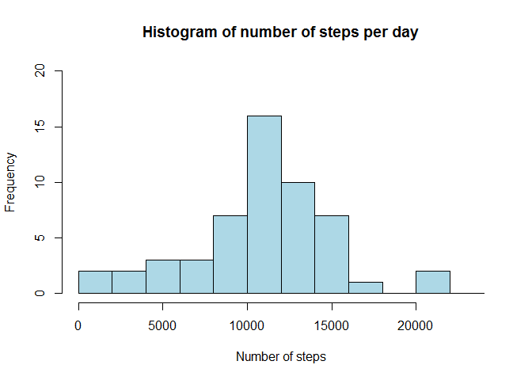
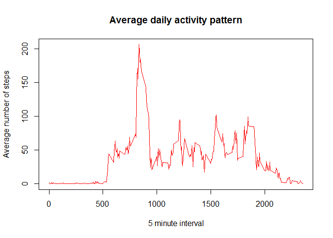
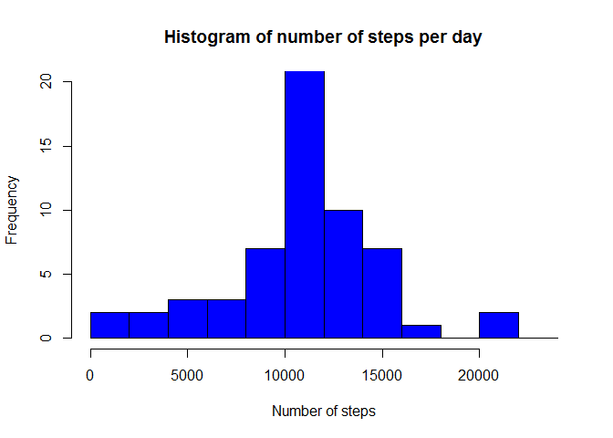
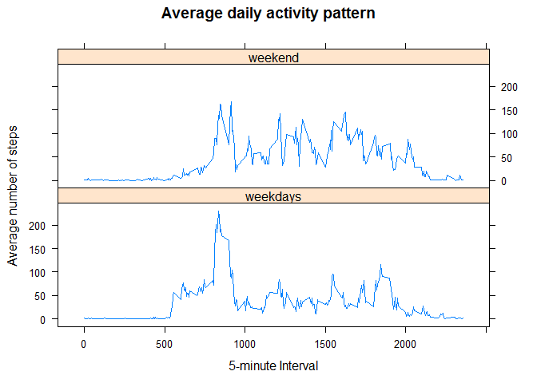

# Reproducible Research: Peer Assessment 1


## Loading and preprocessing the data
###My assumptions are:
- You already ran the command: 'git clone git clone https://github.com/username/RepData_PeerAssessment1.git'. Where "username" is your githup username.
- changed directory to 'RepData_PeerAssessment1'
- The file "activity.zip" does exist.
- The following packages should be installed: 'dplyr' and 'lubridate'
###End 

1. Read the input file

```r
#loading libraries 
library(dplyr)
```

```
## Warning: package 'dplyr' was built under R version 3.1.3
```

```
## 
## Attaching package: 'dplyr'
## 
## The following objects are masked from 'package:stats':
## 
##     filter, lag
## 
## The following objects are masked from 'package:base':
## 
##     intersect, setdiff, setequal, union
```

```r
library(lubridate)
```

```
## Warning: package 'lubridate' was built under R version 3.1.3
```

```r
#First unzip the file
unzip("activity.zip")
#read.csv the activity file and save it in data.fram activityOrig
activityOrig <- read.csv("activity.csv", stringsAsFactors=FALSE)
#convert to data table
activityDT <- tbl_df(activityOrig)
#Change the type of the date from string to date using lubridate method x 
activityDT <- mutate(activityDT,date=ymd(date))
#print the first 10 rows
head(activityDT,10)
```

```
## Source: local data frame [10 x 3]
## 
##    steps       date interval
## 1     NA 2012-10-01        0
## 2     NA 2012-10-01        5
## 3     NA 2012-10-01       10
## 4     NA 2012-10-01       15
## 5     NA 2012-10-01       20
## 6     NA 2012-10-01       25
## 7     NA 2012-10-01       30
## 8     NA 2012-10-01       35
## 9     NA 2012-10-01       40
## 10    NA 2012-10-01       45
```
2.Process the data by doing the folloings steps. 

- 
- Filter all the steps with NA value
- Group the data by date. 
- Summarise the steps (column name is "sum") which calculate the total number of steps taken per day.


```r
  activityDTH <- activityDT %>%
    filter(!is.na(steps)) %>%
    group_by(date) %>%
    summarize(sum=sum(steps))
#print the first 10 rows of the processed data
head(activityDTH,10)
```

```
## Source: local data frame [10 x 2]
## 
##          date   sum
## 1  2012-10-02   126
## 2  2012-10-03 11352
## 3  2012-10-04 12116
## 4  2012-10-05 13294
## 5  2012-10-06 15420
## 6  2012-10-07 11015
## 7  2012-10-09 12811
## 8  2012-10-10  9900
## 9  2012-10-11 10304
## 10 2012-10-12 17382
```
3. Ploting the histogram of number of steps per day

```r
hist(activityDTH$sum, col="lightblue",xlab="Number of steps",
     breaks=seq(from=0,to=25000,by=2000),
     ylim=c(0,20),main="Histogram of number of steps per day")
```

 

## What is mean total number of steps taken per day?
The mean is:

```r
mean(activityDTH$sum)
```

```
## [1] 10766.19
```
The meadian is:

```r
median(activityDTH$sum)
```

```
## [1] 10765
```


## What is the average daily activity pattern?
1. In order to Process the data to find average daily activity pattern need to do the followings or the original data.
- Filter all the steps with NA value
- Group the data by Interval Identifier (values from 0 to 2355)
- Summarise the mean ((column name is "mean") of steps for each interval identifier.


```r
  activityDTInt <- activityDT %>%
    filter(!is.na(steps)) %>%
    group_by(interval) %>%
    summarize(mean=mean(steps))
#print the first 10 rows of the processed data
head(activityDTInt,10)
```

```
## Source: local data frame [10 x 2]
## 
##    interval      mean
## 1         0 1.7169811
## 2         5 0.3396226
## 3        10 0.1320755
## 4        15 0.1509434
## 5        20 0.0754717
## 6        25 2.0943396
## 7        30 0.5283019
## 8        35 0.8679245
## 9        40 0.0000000
## 10       45 1.4716981
```

2. Plot the date, using the plot function y-axis is the interval y-axis is the caluculated mean

```r
plot(activityDTInt$interval, activityDTInt$mean, 
     col="red",type="l",
     xlab="5 minute interval",
     ylab="Average number of steps",
     main="Average daily activity pattern")
```

 
3. Find the max mean entry using function top_n (x,n)  where n is number of rows to return


```r
#find the entry where the mean value is the maximum using top_n returns table with one row 
maxinterval <- top_n(activityDTInt,1,mean)$interval
#
```
The 5-minute interval that contains the maximum of steps, on average across all days is: 835


## Imputing missing values
There are number of days/interval where there are missing values (coded as NA). The presence of missing days may introduce bias into some calculations or summaries of the data.
1. Calculate and report the total number of missing values in the dataset 

```r
missingValCnt <- sum(is.na(activityDT$steps))
```
Number of missing values is: 2304

2. Replace missing data (value NA) in steps with average interval data table that we found above. In this case we need to use 2 data table, the original table and the interval table.
- Join by original table with the interval table by interval value. 
- For each row that steps is equal to NA, take the value 'interval'. 
- Find the 'mean' value of that 'interval' from the interval table. 
- Replace the 'mean' value with 'NA'. 
- Select the same columns names as the original table.


```r
activityDTNoNA <- activityDT %>%
    left_join(activityDTInt,by="interval") %>%
    mutate(steps=ifelse(is.na(steps),mean,steps)) %>%
    select(steps,date,interval)
#print the first 10 rows of the processed data
head(activityDTNoNA,10)
```

```
## Source: local data frame [10 x 3]
## 
##        steps       date interval
## 1  1.7169811 2012-10-01        0
## 2  0.3396226 2012-10-01        5
## 3  0.1320755 2012-10-01       10
## 4  0.1509434 2012-10-01       15
## 5  0.0754717 2012-10-01       20
## 6  2.0943396 2012-10-01       25
## 7  0.5283019 2012-10-01       30
## 8  0.8679245 2012-10-01       35
## 9  0.0000000 2012-10-01       40
## 10 1.4716981 2012-10-01       45
```

```r
#Find number of steps per day , on the new Data table
  activityDTNoNAH <- activityDTNoNA %>%
    filter(!is.na(steps)) %>%
    group_by(date) %>%
    summarize(sum=sum(steps))
#print the first 10 rows of the histogram data
head(activityDTNoNAH,10)
```

```
## Source: local data frame [10 x 2]
## 
##          date      sum
## 1  2012-10-01 10766.19
## 2  2012-10-02   126.00
## 3  2012-10-03 11352.00
## 4  2012-10-04 12116.00
## 5  2012-10-05 13294.00
## 6  2012-10-06 15420.00
## 7  2012-10-07 11015.00
## 8  2012-10-08 10766.19
## 9  2012-10-09 12811.00
## 10 2012-10-10  9900.00
```
3. Ploting the histogram of the new table (without NA values)

```r
hist(activityDTNoNAH$sum, col="blue",xlab="Number of steps",
     breaks=seq(from=0,to=25000,by=2000),
     ylim=c(0,20),main="Histogram of number of steps per day")
```

 
4. Find the mean and median of the new data.
The mean is:


```r
mean(activityDTNoNAH$sum)
```

```
## [1] 10766.19
```
The meadian is:

```r
median(activityDTNoNAH$sum)
```

```
## [1] 10766.19
```

5. The above mean, and median values are a bit different of the mean and median of the original data. Since we replaced the NA values (missing values) with average for each interval the mean did not change, but the median is getting closer to the mean. 

## Are there differences in activity patterns between weekdays and weekends?

First in order to find the activity patterns betwen weekdays and weekend, first we need to add another factor variable 'daytype' with 2 levels "weekdays" or "weekend" indicating whether a given date is a weekday or weekend.
1. Use the data with filled-in missing values.
- if weekdays(date) is "Sunday" or "Saturday" then the value of daytype is "weekend" otherwise "weekdays"
- group the data by daytype and interval.
- summarize by mean of steps to a new new factor mean.


```r
activityDTNew <- activityDTNoNA  %>%
    mutate(daytype = as.factor(ifelse(weekdays(date) %in% c("Saturday","Sunday"),"weekend","weekdays"))) %>% 
    group_by(daytype,interval) %>%
    summarise(mean=mean(steps)) 

#print the first 10 rows of the new data table.
head(activityDTNew,10)
```

```
## Source: local data frame [10 x 3]
## Groups: daytype
## 
##     daytype interval       mean
## 1  weekdays        0 2.25115304
## 2  weekdays        5 0.44528302
## 3  weekdays       10 0.17316562
## 4  weekdays       15 0.19790356
## 5  weekdays       20 0.09895178
## 6  weekdays       25 1.59035639
## 7  weekdays       30 0.69266247
## 8  weekdays       35 1.13794549
## 9  weekdays       40 0.00000000
## 10 weekdays       45 1.79622642
```

2. using xyplot (froml the pacakge lattice) to plot number the 5-minutes interval and number of Average number of steps.

```r
library(lattice)
xyplot(mean ~ interval | daytype,activityDTNew, 
       type="l",lwd=1,
       xlab="5-minute Interval",
       ylab="Average number of steps",main="Average daily activity pattern",
       layout=c(1,2))
```

 

### Done Thank you
